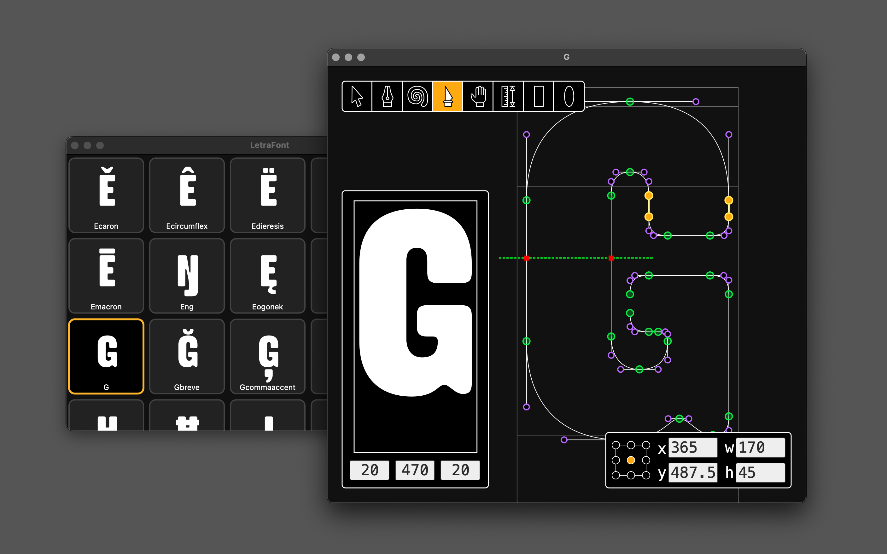

# LetraFont

LetraFont is a cross-platform UFO font editor writen in Rust, still alpha-quality software not ready for use. This project is a fork of [Runebender](https://github.com/linebender/runebender).

